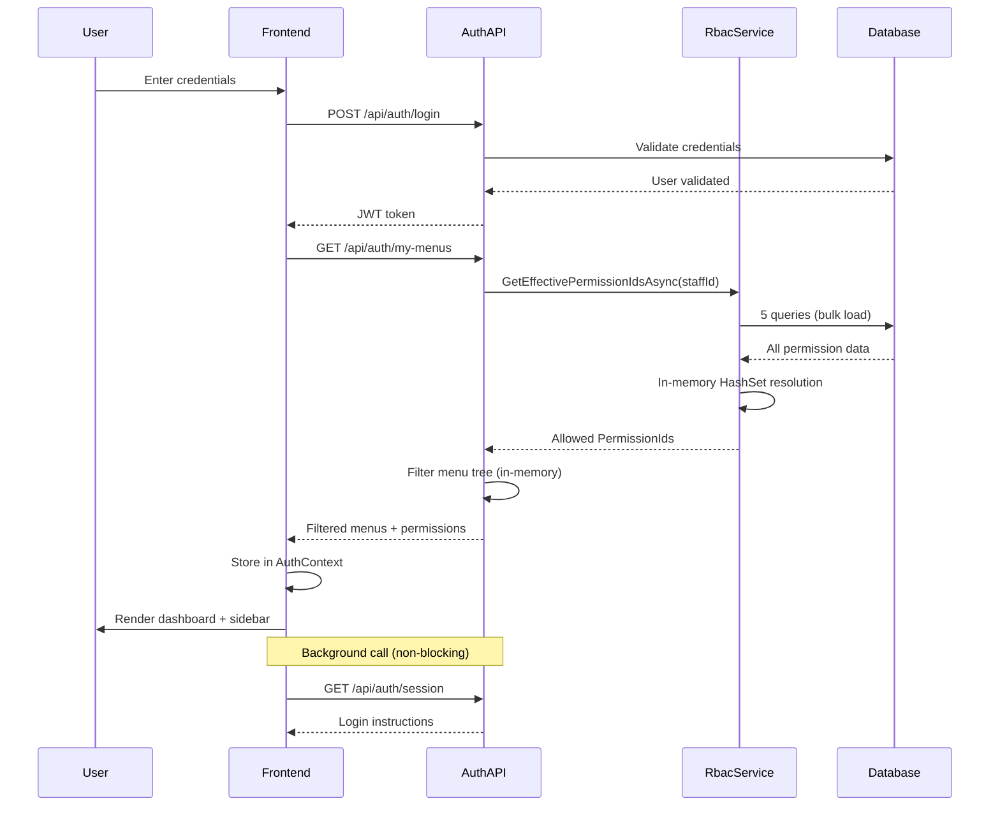
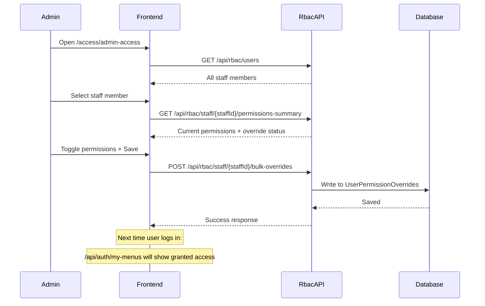

# Accounts System - API Documentation

## 📋 Table of Contents
1. [Authentication & Session APIs](#authentication--session-apis)
2. [RBAC (Role-Based Access Control) APIs](#rbac-role-based-access-control-apis)
3. [Staff & Person Management APIs](#staff--person-management-apis)
4. [Menu Management APIs](#menu-management-apis)
5. [System Architecture](#system-architecture)
6. [Database Schema](#database-schema)

---

## 🔐 Authentication & Session APIs

### Base URL: `/api/auth`

### 1. **POST /api/auth/register**
**Purpose:** Register a new user with a role (Manager / Developer / AssistantManager)

**Access:** Public (AllowAnonymous)

**Request Body:**
```json
{
  "email": "user@example.com",
  "password": "SecurePass123!",
  "role": "Manager"
}
```

**Response:**
```json
{
  "success": true,
  "message": "User registered successfully",
  "userId": "guid-here"
}
```

---

### 2. **POST /api/auth/login** ⚡ PRIMARY LOGIN
**Purpose:** Authenticate user with email and password

**Access:** Public (AllowAnonymous)

**Request Body:**
```json
{
  "email": "user@example.com",
  "password": "SecurePass123!"
}
```

**Response:**
```json
{
  "success": true,
  "token": "jwt-token-here",
  "message": "Login successful"
}
```

**Usage Flow:**
1. User submits credentials
2. Backend validates and returns JWT token
3. Frontend stores token in localStorage/sessionStorage
4. **Next: Call `/api/auth/my-menus` immediately** (optimized fast path)

---

### 3. **GET /api/auth/my-menus** ⚡ FASTEST - PRIMARY MENU ENDPOINT
**Purpose:** Get filtered sidebar menu tree + user permissions in ONE optimized call

**Access:** Requires Authentication

**Performance:** 
- **5-8 database queries total** (NO N+1 loops)
- **<0.5 seconds response time**
- Replaces old `/api/auth/session` slow path

**Query Optimization:**
1. Resolve Person → StaffId (1 query)
2. Bulk-load user overrides (1 query)
3. Bulk-load role permissions (1 query)
4. Bulk-load department matrix (1 query)
5. Bulk-load features (1 query)
6. In-memory HashSet resolution (0 DB hits)
7. Filter menu tree in-memory (0 DB hits)

**Response:**
```json
{
  "status": true,
  "isFullAccess": false,
  "staffId": "guid-here",
  "menus": [
    {
      "id": 1,
      "title": "Dashboard",
      "icon": "home",
      "route": "/dashboard",
      "sortOrder": 1,
      "children": []
    },
    {
      "id": 2,
      "title": "HR Management",
      "icon": "users",
      "route": null,
      "sortOrder": 2,
      "children": [
        {
          "id": 3,
          "title": "Staff Members",
          "icon": "user",
          "route": "/hr/staff",
          "sortOrder": 1,
          "children": []
        }
      ]
    }
  ],
  "permissions": [
    "MENU_1",
    "MENU_1_VIEW",
    "MENU_3",
    "MENU_3_VIEW",
    "MENU_3_EDIT",
    "EMPLOYEE_VIEW",
    "PERSON_VIEW"
  ],
  "permissionDetails": [
    {
      "permissionId": 1,
      "featureKey": "MENU_1",
      "featureName": "Dashboard Menu",
      "module": "Menus"
    },
    {
      "permissionId": 2,
      "featureKey": "EMPLOYEE_VIEW",
      "featureName": "View Employees",
      "module": "Employee"
    }
  ]
}
```

**Special Cases:**
- **SuperAdmin/Admin:** Returns ALL menus and ALL permissions (bypass permission checks)
- **User not hired:** Returns empty arrays (registered but no staff assignment)
- **User with no permissions:** Returns empty arrays

**Frontend Integration:**
```typescript
// After login, call this ONCE
const response = await authApi.getMyMenus();

// Store in context/state
authContext.setMenus(response.menus);
authContext.setPermissions(response.permissions);
authContext.setPermissionDetails(response.permissionDetails);

// Use in-memory for permission checks
const hasAccess = (featureKey: string) => 
  response.permissions.includes(featureKey);
```

---

### 4. **GET /api/auth/session** 🐢 BACKGROUND ONLY
**Purpose:** Get additional session metadata (login instructions, admin notices)

**Access:** Requires Authentication

**⚠️ Usage:** Call this in the BACKGROUND after `/api/auth/my-menus` completes. Not required for sidebar rendering.

**Response:**
```json
{
  "success": true,
  "data": {
    "loginInstructions": "Welcome to the system...",
    "noticeMessage": "System maintenance scheduled...",
    "lastLogin": "2026-06-04T10:30:00Z"
  }
}
```

---

### 5. **POST /api/auth/logout**
**Purpose:** Logout current user

**Access:** Requires Authentication

**Response:**
```json
{
  "success": true,
  "message": "Logged out successfully."
}
```

---

### 6. **POST /api/auth/assign-role**
**Purpose:** Assign a role to an existing user

**Access:** Public (AllowAnonymous) - ⚠️ Should be restricted in production

**Request Body:**
```json
{
  "userId": "guid-here",
  "role": "Manager"
}
```

---

### 7. **GET /api/auth/users**
**Purpose:** Get all system users with their roles

**Access:** Public (AllowAnonymous) - ⚠️ Should be restricted in production

**Response:**
```json
[
  {
    "userId": "guid-here",
    "email": "user@example.com",
    "roles": ["Manager", "Admin"]
  }
]
```

---

## 🔒 RBAC (Role-Based Access Control) APIs

### Base URL: `/api/rbac`

### 1. **GET /api/rbac/users** 👥 ADMIN USER LIST
**Purpose:** Get all registered persons with StaffId for admin UI

**Access:** SuperAdmin, Admin only

**Response:**
```json
[
  {
    "personId": "guid-here",
    "identityUserId": "guid-here",
    "fullName": "John Doe",
    "email": "john@example.com",
    "photoUrl": "https://...",
    "isHired": true,
    "staffId": "guid-here",
    "loginId": "JD001",
    "jobTitle": "Senior Manager"
  }
]
```

**Usage:** Admin opens `/access/admin-access` page → calls this to populate staff dropdown

---

### 2. **GET /api/rbac/staff/{staffId}/permissions-summary** 📊 PERMISSION SUMMARY
**Purpose:** Get all features with current override status for a staff member

**Access:** SuperAdmin, Admin only

**Response:**
```json
{
  "staffId": "guid-here",
  "permissions": [
    {
      "featureKey": "MENU_1",
      "featureName": "Dashboard Menu",
      "module": "Menus",
      "status": "ALLOW",
      "reason": "Set by admin",
      "updatedAt": "2026-06-04T10:30:00Z",
      "hasOverride": true
    },
    {
      "featureKey": "EMPLOYEE_VIEW",
      "featureName": "View Employees",
      "module": "Employee",
      "status": "INHERIT",
      "reason": null,
      "updatedAt": null,
      "hasOverride": false
    }
  ]
}
```

**Usage:** Admin views permissions grid for a specific user

---

### 3. **POST /api/rbac/staff/{staffId}/bulk-overrides** ⚡ SAVE PERMISSIONS
**Purpose:** Bulk-save permission overrides from admin UI (PRIMARY SAVE ENDPOINT)

**Access:** SuperAdmin, Admin only

**Request Body:**
```json
{
  "MENU_1": "ALLOW",
  "MENU_1_VIEW": "ALLOW",
  "MENU_3": "DENY",
  "EMPLOYEE_EDIT": "INHERIT",
  "PERSON_VIEW": "ALLOW"
}
```

**Status Values:**
- `"ALLOW"` - Grant access (override)
- `"DENY"` - Deny access (override)
- `"INHERIT"` - Remove override (revert to role default)

**Response:**
```json
{
  "message": "5 permission(s) saved, 0 skipped (invalid keys/status).",
  "staffId": "guid-here",
  "saved": 5,
  "skipped": 0
}
```

**Usage Flow:**
1. Admin toggles permissions in UI grid
2. Admin clicks "Save Changes"
3. Frontend calls `rbacApi.bulkSetOverrides(staffId, overrides)`
4. Backend writes to `UserPermissionOverrides` table
5. Next time user logs in → `my-menus` reflects the new permissions

**Frontend Integration:**
```typescript
const overrides: Record<string, 'ALLOW' | 'DENY'> = {
  'MENU_1': 'ALLOW',
  'MENU_1_VIEW': 'ALLOW',
  'EMPLOYEE_EDIT': 'DENY'
};

await rbacApi.bulkSetOverrides(staffId, overrides);
```

---

### 4. **GET /api/rbac/staff/{staffId}/has-access/{featureKey}**
**Purpose:** Check if a staff member has access to a specific feature

**Access:** Requires Authentication

**Response:**
```json
{
  "staffId": "guid-here",
  "featureKey": "EMPLOYEE_VIEW",
  "hasAccess": true
}
```

---

### 5. **GET /api/rbac/staff/{staffId}/effective-permissions** 📋 DETAILED PERMISSIONS
**Purpose:** Get all effective permissions with source resolution

**Access:** Requires Authentication

**Response:**
```json
[
  {
    "featureKey": "MENU_1",
    "featureName": "Dashboard Menu",
    "hasAccess": true,
    "source": "UserOverride"
  },
  {
    "featureKey": "EMPLOYEE_VIEW",
    "featureName": "View Employees",
    "hasAccess": true,
    "source": "RoleDefault"
  },
  {
    "featureKey": "EMPLOYEE_EDIT",
    "featureName": "Edit Employee",
    "hasAccess": false,
    "source": "Denied"
  }
]
```

**Permission Sources:**
- `"UserOverride"` - Explicitly set by admin in UserPermissionOverrides
- `"RoleDefault"` - From RolePermissions (job title default)
- `"DepartmentMatrix"` - From DepartmentAccessMatrix
- `"Denied"` - No permission found

---

### 6. **GET /api/rbac/sidebar** 🗂️ FILTERED SIDEBAR (LEGACY)
**Purpose:** Get filtered sidebar for current user

**Access:** Requires Authentication

**⚠️ Deprecated:** Use `/api/auth/my-menus` instead (faster, includes permissions)

---

### 7. **PUT /api/rbac/staff/{staffId}/overrides/{featureKey}** 🔧 SINGLE OVERRIDE
**Purpose:** Set a single permission override

**Access:** Requires Authentication

**Request Body:**
```json
{
  "status": "ALLOW",
  "reason": "Manager requested access"
}
```

**⚠️ Usage:** For single permission changes. Use `/bulk-overrides` for batch updates.

---

### 8. **DELETE /api/rbac/staff/{staffId}/overrides/{featureKey}**
**Purpose:** Remove a user-specific override (revert to role default)

**Access:** Requires Authentication

---

### 9. **GET /api/rbac/roles/{jobTitle}/permissions**
**Purpose:** Get default permissions for a job title

**Access:** Requires Authentication

**Query Parameters:**
- `deptId` (optional) - Filter by department

---

### 10. **PUT /api/rbac/roles/{jobTitle}/permissions**
**Purpose:** Set default permissions for a job title in a department

**Access:** Requires Authentication

**Request Body:**
```json
{
  "EMPLOYEE_VIEW": true,
  "EMPLOYEE_EDIT": false,
  "PERSON_VIEW": true
}
```

---

### 11. **POST /api/rbac/seed-features** 🌱 INITIALIZE FEATURES
**Purpose:** Seed Features table with menu keys and system features

**Access:** Public (AllowAnonymous) - Run once during setup

**What it does:**
1. Creates `MENU_{id}` entries for each menu
2. Creates `MENU_{id}_VIEW`, `MENU_{id}_ADD`, `MENU_{id}_EDIT`, `MENU_{id}_DELETE` CRUD keys
3. Creates static system features (DEPT_VIEW, EMPLOYEE_VIEW, etc.)

**Response:**
```json
{
  "message": "Seed complete.",
  "menuFeatures": { "added": 45, "skipped": 0 },
  "staticFeatures": { "added": 28, "skipped": 0 },
  "totalFeatures": 73,
  "nextStep": "Call PUT /api/rbac/staff/{staffId}/overrides/{featureKey} to grant access."
}
```

**⚠️ IMPORTANT:** Run this BEFORE granting any permissions. The `Features` table is the master list.

---

## 👥 Staff & Person Management APIs

### 1. **GET /api/staff**
**Purpose:** Get all staff members

**Response:**
```json
[
  {
    "staffId": "guid-here",
    "loginId": "JD001",
    "fullName": "John Doe",
    "jobTitle": "Senior Manager",
    "department": "HR",
    "email": "john@example.com"
  }
]
```

---

### 2. **GET /api/persons**
**Purpose:** Get all registered persons

---

## 📋 Menu Management APIs

### 1. **GET /api/menus**
**Purpose:** Get all menus (admin view - unfiltered)

**Access:** Requires Authentication

---

### 2. **POST /api/menus**
**Purpose:** Create a new menu item

**Access:** Admin only

---

## 🏗️ System Architecture

### User Login Flow (Optimized)



**Total Database Queries:** 5-8 (fixed, no loops)  
**Response Time:** <0.5 seconds  
**Old System:** 500+ queries, 2+ minutes

---

### Admin Grants User Access Flow



---

## 🗄️ Database Schema

### Core Permission Tables

#### 1. **Features** (Master Permission List)
```sql
CREATE TABLE Features (
    PermissionId INT PRIMARY KEY IDENTITY(1,1),
    FeatureKey NVARCHAR(200) UNIQUE NOT NULL,
    FeatureName NVARCHAR(200) NOT NULL,
    Module NVARCHAR(100) NULL,
    Description NVARCHAR(MAX) NULL,
    CreatedAt DATETIME2 DEFAULT GETUTCDATE()
);
```

**Examples:**
- `MENU_1` → Dashboard Menu
- `MENU_3_VIEW` → Staff Members View
- `EMPLOYEE_EDIT` → Edit Employee Permission
- `DEPT_VIEW` → View Department Permission

---

#### 2. **UserPermissionOverrides** (User-Specific Overrides)
```sql
CREATE TABLE UserPermissionOverrides (
    StaffId UNIQUEIDENTIFIER NOT NULL,
    PermissionId INT NOT NULL,
    Status NVARCHAR(20) NOT NULL, -- 'ALLOW' or 'DENY'
    SetBy NVARCHAR(450) NULL,
    SetDate DATETIME2 DEFAULT GETUTCDATE(),
    Reason NVARCHAR(500) NULL,
    PRIMARY KEY (StaffId, PermissionId),
    FOREIGN KEY (PermissionId) REFERENCES Features(PermissionId),
    FOREIGN KEY (StaffId) REFERENCES StaffVacancies(StaffId)
);
```

**Purpose:** Admin explicitly grants or denies specific permissions to individual users.

---

#### 3. **RolePermissions** (Job Title Defaults)
```sql
CREATE TABLE RolePermissions (
    RolePermissionId INT PRIMARY KEY IDENTITY(1,1),
    JobTitle NVARCHAR(100) NOT NULL,
    PermissionId INT NOT NULL,
    DeptId INT NULL,
    IsAllowed BIT NOT NULL DEFAULT 1,
    SetBy NVARCHAR(450) NULL,
    SetDate DATETIME2 DEFAULT GETUTCDATE(),
    FOREIGN KEY (PermissionId) REFERENCES Features(PermissionId),
    FOREIGN KEY (DeptId) REFERENCES OrganizationTree(OrgId)
);
```

**Purpose:** Default permissions for each job title (e.g., all "Managers" can view employees).

---

#### 4. **DepartmentAccessMatrix**
```sql
CREATE TABLE DepartmentAccessMatrix (
    MatrixId INT PRIMARY KEY IDENTITY(1,1),
    StaffId UNIQUEIDENTIFIER NOT NULL,
    DeptId INT NOT NULL,
    PermissionId INT NOT NULL,
    AccessLevel NVARCHAR(20) DEFAULT 'VIEW', -- 'VIEW', 'EDIT', 'FULL'
    SetBy NVARCHAR(450) NULL,
    SetDate DATETIME2 DEFAULT GETUTCDATE(),
    FOREIGN KEY (PermissionId) REFERENCES Features(PermissionId),
    FOREIGN KEY (StaffId) REFERENCES StaffVacancies(StaffId),
    FOREIGN KEY (DeptId) REFERENCES OrganizationTree(OrgId)
);
```

**Purpose:** Grant users access to specific departments (cross-department access).

---

#### 5. **Menus** (Sidebar Structure)
```sql
CREATE TABLE Menus (
    Id INT PRIMARY KEY IDENTITY(1,1),
    Title NVARCHAR(100) NOT NULL,
    Icon NVARCHAR(50) NULL,
    Route NVARCHAR(200) NULL,
    ParentId INT NULL,
    SortOrder INT DEFAULT 0,
    IsActive BIT DEFAULT 1,
    FOREIGN KEY (ParentId) REFERENCES Menus(Id)
);
```

---

#### 6. **MenuPermissions** (Menu → Feature Links)
```sql
CREATE TABLE MenuPermissions (
    MenuId INT NOT NULL,
    PermissionId INT NOT NULL,
    PRIMARY KEY (MenuId, PermissionId),
    FOREIGN KEY (MenuId) REFERENCES Menus(Id) ON DELETE CASCADE,
    FOREIGN KEY (PermissionId) REFERENCES Features(PermissionId) ON DELETE CASCADE
);
```

**Purpose:** Links menus to required features. Empty = public menu (visible to all).

---

### Permission Resolution Order

When checking if a user has access to `EMPLOYEE_EDIT`:

1. **Check UserPermissionOverrides** (highest priority)
   - If `ALLOW` → ✅ Grant access
   - If `DENY` → ❌ Deny access
   - If not found → Continue to step 2

2. **Check RolePermissions** (job title default)
   - Match by `StaffId.JobTitle` + optional `DeptId`
   - If `IsAllowed = 1` → ✅ Grant access
   - If not found → Continue to step 3

3. **Check DepartmentAccessMatrix** (cross-department access)
   - If permission exists → ✅ Grant access
   - If not found → ❌ Deny access (default deny)

---

## 🚀 Frontend Integration Examples

### 1. Login + Load Menus (AuthContext.tsx)

```typescript
const login = async (email: string, password: string) => {
  // Step 1: Authenticate
  const loginRes = await authApi.login({ email, password });
  
  // Step 2: Fast menu load (5-8 queries, <0.5s)
  const menusRes = await authApi.getMyMenus();
  
  // Step 3: Store in context
  setMenus(menusRes.menus);
  setUserPermissions(menusRes.permissions);
  setPermissionDetails(menusRes.permissionDetails);
  setIsFullAccess(menusRes.isFullAccess);
  
  // Step 4: Background session load (non-blocking)
  authApi.getSession().then(sessionRes => {
    setSession(sessionRes.data);
  });
};
```

---

### 2. Admin Grants Access (AdminAccessPage.tsx)

```typescript
const handleSave = async () => {
  // Build overrides dict: featureKey → "ALLOW" | "DENY"
  const overrides: Record<string, 'ALLOW' | 'DENY'> = {};
  
  for (const [staffId, permissions] of Object.entries(permissionsState)) {
    for (const [featureKey, granted] of Object.entries(permissions)) {
      overrides[featureKey] = granted ? 'ALLOW' : 'DENY';
    }
  }
  
  // Bulk save
  await rbacApi.bulkSetOverrides(staffId, overrides);
  
  // Refresh UI
  setShowSaveSuccess(true);
  window.dispatchEvent(new CustomEvent('navigation-updated'));
};
```

---

### 3. Permission Check (Component)

```typescript
const { hasPermission } = useAuth();

// Check before rendering
if (!hasPermission('EMPLOYEE_EDIT')) {
  return <NoAccessMessage />;
}

// Check before action
const handleEdit = () => {
  if (!hasPermission('EMPLOYEE_EDIT')) {
    toast.error('You do not have permission to edit employees');
    return;
  }
  // Proceed with edit
};
```

---

## 📊 Performance Metrics

### Before Optimization (Old System)
- **Queries per login:** 500+ (N+1 loop)
- **Response time:** 2+ minutes
- **User experience:** Loading screen freeze

### After Optimization (Current System)
- **Queries per login:** 5-8 (bulk load)
- **Response time:** <0.5 seconds
- **User experience:** Instant dashboard render

### Query Breakdown (my-menus endpoint)
1. Resolve Person → StaffId: **1 query**
2. Load UserPermissionOverrides: **1 query**
3. Load RolePermissions: **1 query**
4. Load DepartmentAccessMatrix: **1 query**
5. Load Features: **1 query**
6. Load Menus + MenuPermissions: **1-2 queries**
7. In-memory HashSet resolution: **0 queries** ✅
8. Filter menu tree: **0 queries** ✅

---

## ✅ API Usage Checklist

### Initial Setup (Run Once)
- [ ] `POST /api/rbac/seed-features` - Initialize Features table
- [ ] Verify Features table contains MENU_* keys and system features

### Admin Workflow (Grant User Access)
1. [ ] `GET /api/rbac/users` - Get staff list
2. [ ] `GET /api/rbac/staff/{staffId}/permissions-summary` - Load current permissions
3. [ ] `POST /api/rbac/staff/{staffId}/bulk-overrides` - Save changes

### User Login Workflow (Frontend)
1. [ ] `POST /api/auth/login` - Authenticate
2. [ ] `GET /api/auth/my-menus` - Load menus + permissions (FAST)
3. [ ] `GET /api/auth/session` - Load session metadata (background, optional)

### Permission Check (Frontend)
- [ ] Use `hasPermission(featureKey)` from AuthContext (in-memory, instant)
- [ ] Do NOT call `/api/rbac/has-access` on every render (inefficient)

---

## 🔗 Related Documentation

- [ARCHITECTURE_DIAGRAM.md](./Accounts/ARCHITECTURE_DIAGRAM.md) - System architecture diagrams
- [RBAC_REFACTOR_README.md](./Accounts/Database/RBAC_REFACTOR_README.md) - Database migration guide
- [Frontend README](./Frontend/Frontend-Accounts-main/README.md) - Frontend setup

---

## 📞 Support

For questions or issues, please contact the development team.

**Last Updated:** June 4, 2026
